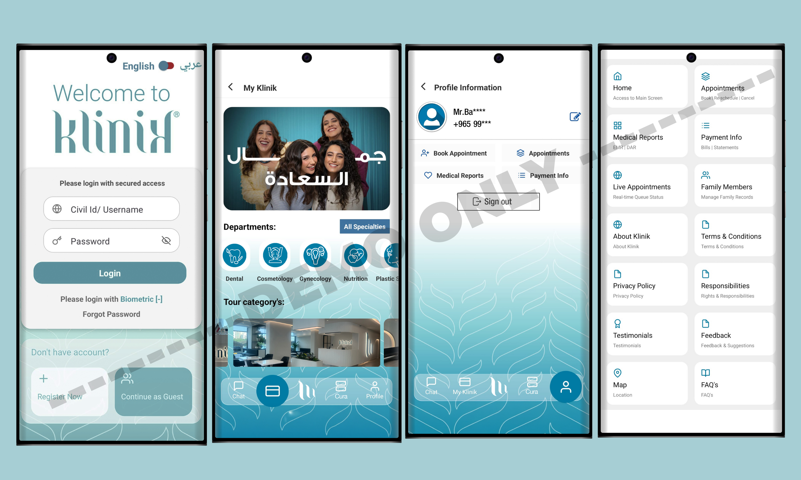

# 🛡️ Klinik (For Demo Use Only)
### Industrial Portfolio — UI Showcase  
**Note:** This application belongs to **Klinik Group, Kuwait**.  
This repository is created **only for demo and presentation purposes** to showcase UI work, improvements, and contributions.

---

## 📌 About the App

**Klinik** is a mobile application designed for patients in Kuwait to access clinical consultation packages and receive their test reports directly within the app.  
The app provides various consultation and diagnostic packages tailored for end-users.  
This demo repository does **not** contain production code or proprietary implementation.  
It only includes **visual previews** strictly for portfolio and hiring review.

---

## 👨‍💻 My Role & Contributions

I worked on the **entire development** of the Klinik app while working with **Square House**, for the client Klinik Group in Kuwait:

- 🏗️ **Built the app structure and developed all screens from scratch**  
- 💳 **Integrated Kuwait’s popular payment gateway, MyFatoorah**  
- 🛠️ **Handled recurring bugs and maintained app stability over time**  
- 🎨 **Polished UI layouts and improved overall user experience**  
- 📱 **Enhanced app flow and user interaction throughout all modules**

This portfolio highlights the **complete interface and system flow** I worked on, without exposing proprietary code.

---

## 🧩 Demo Assets Included  

This repository contains **only the following items**:

- ✔ **App Icon**  
- ✔ **Two landscape showcase strips** (showing multiple screens)  
- ❌ No source code  
- ❌ No backend logic  
- ❌ No proprietary files  

Everything presented is strictly for **visual demonstration**.

---

## 🖼️ Visual Preview

### **App Icon**

---

### **Showcase — Landscape Preview 1**

---

## 📥 Download (Official Links)

> Note: These links belong to the **original Klinik application**.

**Google Play:**  
[View it on Google Play](https://play.google.com/store/apps/details?id=com.zestwings.klinikmedicalkw&hl=en)

**App Store:**  
[View it on App Store](https://apps.apple.com/ly/app/my-klinik/id1548941829)

---

## 📄 Disclaimer

This repository is **not affiliated with, endorsed by, or officially representing Klinik Group**.  
It is intended **solely to demonstrate my UI contributions and app development work**.  
All rights to the original application belong to **Klinik Group, Kuwait**.

---

## 📬 Contact

For professional work, collaborations, or UI development:

**Email:** hamzabilalgaya.bilal@gmail.com  
**LinkedIn:** [View my LinkedIn Profile](https://www.linkedin.com/in/hamza-bilal-g-4259a8181)  
**Fiverr:** [View my Fiverr profile](https://www.fiverr.com/s/EgZdxBK)  
**Upwork:** [View my Upwork profile](https://www.upwork.com/freelancers/~01474d05eaa4a6e38b)  

---

## ⭐ Support My Work

If you like my work and want to support future UI components, tutorials, and open source:

### ☕ **Buy Me a Coffee**  

---
